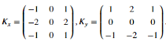

# Processamento de imagem
## Resumo:

A área visão computacional envolve a percepção e a inteligência humana, o que a torna muito interessante
para estudos e pesquisas, sabendo que com ela, pode-se copiar o comportamento humano em computadores
por meio de câmeras, entregando inteligência a máquinas com aplicações notáveis em diversos campos,
como ecologia, medicina, indústria automotiva, mercado financeiro e segurança.
Hoje, em aplicações mais intensivas como a missão do robô curiosity da NASA (National Aeronautics and 
Space Administration ), a performance é otimizada por meio de hardware para atender os requisitos do
usuário final, evitando a segurança reduzida de modelos construídos por software.
O processamento de imagem é composto de 4 etapas:
* Pré processamento: Agregação e busca de informações no conteúdo.
* Segmentação: Separação em grupos similares.
* Extração de *features*: Redução de dados redundantes.
* Reconhecimento: Obtenção de informações a partir de dados multidimensionais.
Essas etapas são necessárias para um bom funcionamento da visão computacional, focando sempre na melhor 
performance com menor custo computacional a partir de técnicas que alteram variáveis da imagem, como ruído, 
brilho e saturação.
Nesse relatório, há a atuação da etapa 1 em um dataset reduzido, focando em imagens que tem como objeto 
principal o rosto humano.

## Fundamentação teórica:

### Filtro passa baixa

Para filtrar a imagem, fazemos uso de um filtro analógico digitalizado, utilizamos então a transformada z para trazer esse filtro para o campo discreto.
A transformada z é uma transformação matemática do domínio s para o domínio z.

Em que T é o período de amostragem.

Fazemos então o design do filtro passa baixa que será utilizado como entrada para o filtro bilinear a partir de um design passa-baixa, pois o nosso foco é suavizar a imagem.

Utilizando valores de R = 100k&ohm; e C = 150&micro;F, temos
um filtro com &omega;c = 15Hz que terá o denominador e o numerador da função de transferência iguais a 1 e 4.

Tendo feito o design desse filtro, podemos aplicar na função signal bilinear do [Scipy](https://docs.scipy.org/doc/scipy/reference/signal.html) que nos entregará o filtro IIR.

### Derivada

Nessa etapa, fazemos a derivada em linhas e em seguida em colunas. Sabemos portanto que temos uma função do tipo:

    

Aplicando a função diff da biblioteca [Numpy](https://numpy.org/doc/) e dividindo pelo intervalo utilizado, temos os resultados observados nas imagens.

## Metodologia:

### Aquisição de imagens: 

As imagens podem ser adquiridas por meio de fotos retiradas de câmeras digitais ou de pesquisas na internet, 
contanto que esteja no formato *Tiff* e as suas dimensões horizontais e verticais tenham mesmo tamanho, ou seja, 
as imagens necessariamentes tem de ser quadradas. O programa inspeciona as imagens linha a linha de forma que é 
possível análisar a qualidade da imagem utilizada.

### Remoção de ruído:

Para remoção de ruído de uma imagem, aplicamos um filtro passa-baixa, o objetivo desse filtro é remover as 
variações súbidas no brilho de uma parte da imagem utilizando o ponto médio dentre os valores dados. Na literatura, 
temos documentada a maior efetividade em alguns casos de filtros que utilizam a mediana.

Após a utilização de um filtro passa baixa, é costume utilizar um segundo filtro passa-alta com objetivo de 
melhorar a definição da imagem, ao contrário do passa baixas que suaviza a imagem.

### Derivação:

Quando desejamos extrair uma imagem que tenha o foco em bordas de objetos, ou seja, focada em pontos em que a 
variação de contraste é alta, aplicamos a derivada por sua definição. Na literatura encontramos casos de maior 
precisão em derivadas focadas nos operadores de Sobel-Feldman e no filtro de suavização Gaussiano. Apesar de 
podermos utilizar a derivada pela definição para extrair as bordas, fazemos o uso de um kernel gaussiano para 
extrair uma imagem com foco em bordas e termos um resultado mais interessante visualmente.

### Mudança de fase:

É aplicado um filtro passa-todas para variar a relação entre as fases das várias frequências, mantendo no entanto a 
amplitude. Diferente dos outros filtros anteriormente aplicados, esse não reduz a magnitude do sinal, mas leva as 
imagens ao plano dos complexos, defasando a imagem lateralmente, pois é assim que o filtro é aplicado.

### Detecção de bordas:

Para esse ultimo filtro, o resultado da derivação poderia ser utilizado, mas com objetivo de melhorar a precisão, 
faz-se uso de um filtro gaussiano, pois a sua efetividade é maior dado o fato de que o mesmo faz uso de um kernel 
de tamanho n+1 tanto no eixo X quanto no eixo Y, enquanto os procedimentos aplicados anteriormente se limitavam a 
um dos eixos ou um dos eixos por vez.

Para complementar, aplicamos outros 3 filtros para separar píxeis em bordas de píxeis fora de bordas e por último 
geramos uma imagem apenas com píxeis considerados fortes ressaltados em relação ao fundo preto.

## Análise:

Para verificação dos dados obtidos pelo programa, foram utilizadas 2 imagens similares, uma de 1972 e outra de poucos meses atrás, elas são apresentadas abaixo.

    
    
    
    

Durante a execução do programa faz-se a aquisição de 1 imagem para teste isolado, utilizamos a função [opencv](https://docs.opencv.org/3.4/), e apos definir a forma que esperamos para trabalhar com as imagens, fazemos a remoção de ruído a partir de um filtro bilinear no eixo X. Obtemos as imagens abaixo.

    
    
    
    

Em seguida, aplicamos o mesmo filtro em Y, mas na entrada, colocamos a imagem que passou pelo filtro no eixo X. Obtemos as seguintes imagens.

    
    
    
    

# Why this shit is right 

Faz-se a derivada das imagens no eixo X, obtendo como resultado as imagens abaixo. Vale a ressalva de que a imagem de 1972 é claramente mais ruidoza, como podemos ver na derivada RGB.

    
    
    
    

# Why this other shit is right 

Além disso, fazemos a implementação de um filtro passa-todas, que resulta nas imagens abaixo.

    
    
    
    
    
    
    
    

# Why this 3rd shit is right 

E por fim, implementamos um algoritmo para edge detection, que com bom resultado entrega as imagens abaixo.

    
    
    
    

# Why this last shit is right 

## Conclusão:
## Referências:

