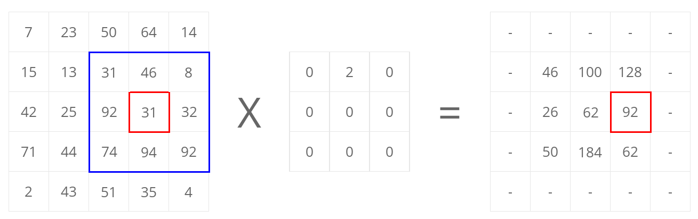
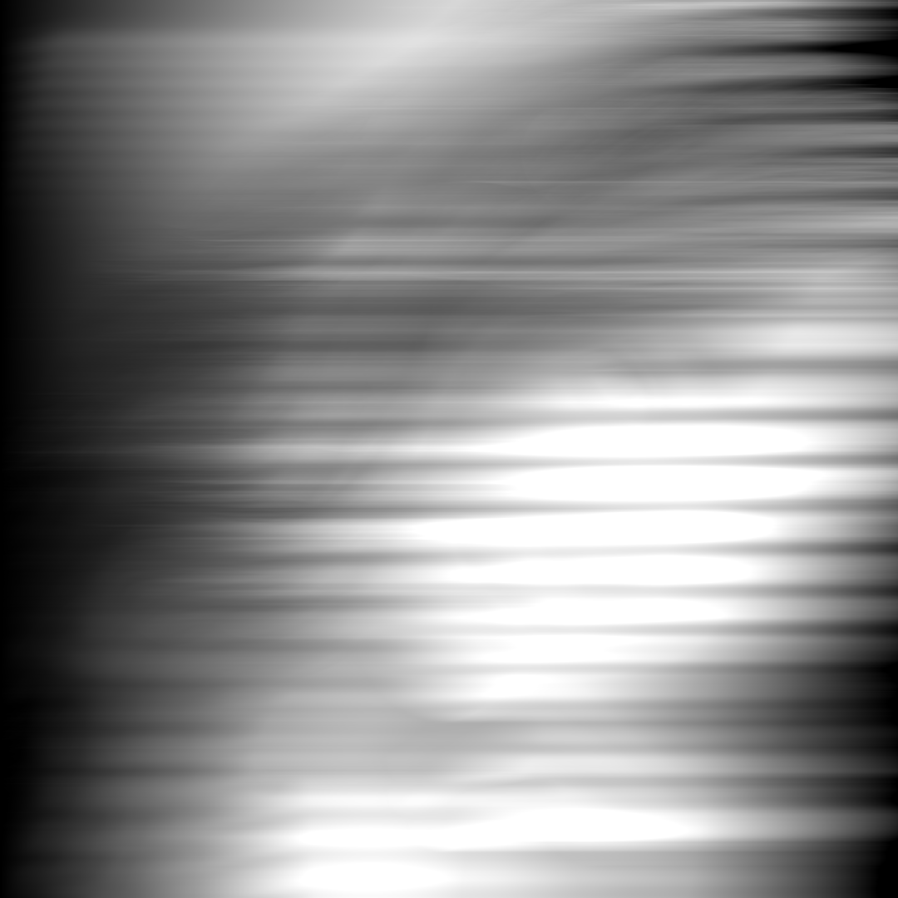

# Processamento de imagem

## Antes da leitura:

Dependendo do leitor markdown utilizado, algumas das imagens podem aparecer completamente pretas, erro causado pela compressão mal utilizada. Recomenda-se a visualização desse documento no [Visual Studio Code](https://code.visualstudio.com/download) para evitar erros não relacionados a este projeto (upstream).

## Resumo:

A área visão computacional envolve a percepção e a inteligência humana, o que a torna muito interessante para estudos e pesquisas, sabendo que com ela, pode-se copiar o comportamento humano em computadores por meio de câmeras, entregando inteligência a máquinas com aplicações notáveis em diversos campos, como ecologia, medicina, indústria automotiva, mercado financeiro e segurança.
Hoje, em aplicações mais intensivas como a missão do robô curiosity da NASA (National Aeronautics and Space Administration ), a performance é otimizada por meio de hardware para atender os requisitos do usuário final, evitando a segurança reduzida de modelos construídos por software.
O processamento de imagem é composto de 4 etapas:
* **Pré processamento:** Agregação e busca de informações no conteúdo.
* **Segmentação:** Separação em grupos similares.
* **Extração de *features*:** Redução de dados redundantes.
* **Reconhecimento:** Obtenção de informações a partir de dados multidimensionais.
Essas etapas são necessárias para um bom funcionamento da visão computacional, focando sempre na melhor performance com menor custo computacional a partir de técnicas que alteram variáveis da imagem, como ruído, brilho e saturação.
Nesse relatório, há a atuação da etapa 1 em um dataset reduzido, focando em imagens que tem como objeto principal o faces.

## Fundamentação teórica:

### Filtro passa-baixa

Para suavizar a imagem, fazemos uso de um filtro analógico passa-baixa digitalizado, o método surge a partir transformada z que consegue trazer esse filtro para o campo discreto.
A transformada z é uma transformação matemática do domínio s para o domínio z a partir da substituição da variável s na função de transferência de acordo com a equação utilizada abaixo.

Em que T é o período de amostragem.

Fazemos então o design do filtro que será utilizado como entrada para a função bilinear a partir de um filtro analógico passa-baixa, pois o nosso foco é suavizar a imagem.

Utilizando valores de R = 100k&ohm; e C = 150&micro;F, temos um filtro com Fc = 2.39Hz que tem denominador = 1 e numerador = 4 na função de transferência.

Foi projetado, então, um filtro com um comportamento similar ao exibido abaixo.

    

Tendo feito o projeto desse filtro, podemos aplicar a função bilinear da biblioteca [Scipy](https://docs.scipy.org/doc/scipy/reference/signal.html), que nos entregará um filtro IIR aplicável à imagem.

### Derivada

Nessa etapa, fazemos a derivada em linhas e em seguida em colunas. Sabemos portanto que precisamos usar uma função do tipo:

    

Aplicando a função diff da biblioteca [Numpy](https://numpy.org/doc/) e dividindo pelo intervalo utilizado, conseguimos obter a imagem desejada. Haverá um destrinchamento melhor dos resultados nas seções abaixo.

## Metodologia:

### Aquisição de imagens: 

As imagens podem ser adquiridas por meio de fotos retiradas de câmeras digitais ou de pesquisas na internet, contanto que esteja no formato *Tiff* e as suas dimensões horizontais e verticais tenham mesmo tamanho, ou seja, as imagens tem de ser quadradas. O programa inspeciona as imagens linha a linha e depois coluna a coluna de forma que é possível análisar a qualidade da imagem utilizada durante a implementação dos filtros.

### Remoção de ruído:

Para remoção de ruído de uma imagem, aplicamos um filtro passa-baixa como o projetado acima, o objetivo desse filtro é remover as variações súbitas no brilho de uma parte da imagem utilizando o ponto médio dentre os valores dados. Aplicamos esse filtro em todas as linhas e em seguida em todas as colunas.

Após a utilização de um filtro passa baixa, é costume utilizar um filtro passa-alta com objetivo de melhorar a definição da imagem, nesse projeto, no entanto, nos limitamos à aplicação apenas do passa-baixa.

### Derivada:

Quando desejamos extrair uma imagem que tenha o foco em bordas de objetos, ou seja, em pontos em que a variação de contraste é alta, aplicamos um filtro derivador.

 Na literatura encontramos casos de maior precisão em derivadas focadas nos operadores de Sobel-Feldman após implementação do filtro de suavização Gaussiano. Fazemos a derivada em todas as linhas e em seguida em todas as colunas para obter as imagens com foco em bordas.

### Mudança de fase:

É aplicado um filtro passa-todas para variar a relação entre as fases das várias frequências, mantendo no entanto a amplitude. Diferente dos filtros anteriormente aplicados, esse não reduz a magnitude do sinal, mas defasa a imagem no sentido em que o filtro é aplicado.

Fazemos uso desse filtro nas linhas e em seguida nas colunas, apresentamos os resultados na seção apropriada.

### Detecção de bordas:

Para esse ultimo filtro, o resultado da derivação poderia ser utilizado, mas com objetivo de melhorar a precisão, faz-se uso de um filtro gaussiano, pois a sua efetividade é maior dado o fato de que o mesmo faz uso de um *kernel* de tamanho n+1 tanto no eixo X quanto no eixo Y, enquanto os procedimentos aplicados anteriormente se limitavam a um dos eixos ou um dos eixos por vez.
Exemplificamos a convolução realizada com a imagem abaixo. O kernel utilizado tem, no entanto, valores e formato diferentes na matriz de convolução, sendo ela 5x5.

Uma das vantagens dessa aplicação é a não perda de intensidade das imagens, tendo efetividade superior ao filtro passa-baixa aplicado acima.

Para complementar, aplicamos outros 3 filtros para separar píxeis em bordas de píxeis fora de bordas. Fazemos essa separação a partir do cálculo do gradiente da imagem. Se declararmos Kx e Ky como kerneis Sobel representados abaixo, podemos fazer convoluções entre a imagem suavizada e os kerneis abaixo.

Assim obtemos magnitude e ângulo do gradiente. Esse resultado é apenas uma detecção de mudança de contraste ocorrida na imagem, as bordas detectadas são, portanto, suaves assim como a imagem original.

Para resolver esse problema, fazemos a remoção com base em valores minimos e máximos de branco e preto, pois assim escolhemos os valores mais fortes dentre os que foram separados anteriormente como magnitude.
Após essa aplicação, temos resultados similares aos obtidos a partir das derivadas, mas com a vantagem de maior precisão.

Por último recorremos à "mineração" de píxeis medianos, extraindo os píxeis que são fortes verificando os arredores. O método aplicado avalia caso algum píxel ao redor do central seja branco forte, podemos fazer um branco mediano ser considerado branco forte então a partir desse método.

Tendo percorrido essas etapas, temos por fim uma imagem com bordas detectadas. Os resultados estão apresentados na seção apropriada.

## Análise:

Para verificação dos dados obtidos pelo programa, foram utilizadas 2 imagens similares, uma de 1972 ([Lena Söderberg](https://en.wikipedia.org/wiki/Lena_Fors%C3%A9n)) e outra de poucos meses atrás ([Naturally_Madi](https://www.instagram.com/naturally_madi/)), elas são apresentadas abaixo em sua forma original e preto e branco.

    
    
    
    

Durante a execução do programa faz-se a aquisição de uma imagem RGB que é separada em duas matrizes, uma BGR e outra preto e branco, utilizamos a biblioteca [opencv](https://docs.opencv.org/3.4/), e após converter a matriz de BGR para RGB, fazemos a remoção de ruído a partir do filtro bilinear no eixo X (filtro de linhas). Obtemos as imagens abaixo após a a filtragem inicial.

    
    
    
    

Em seguida, aplicamos o mesmo filtro em Y (filtro de colunas), mas na entrada, colocamos a imagem anteriormente filtrada no eixo X. Obtemos as imagens abaixo após isso.

    
    
    
    

A partir dos dois resultados acima, podemos validar que as imagens estão corretas, pois o filtro passa-baixa está fazendo bem o seu papel de reduzir a energia da imagem. Essa etapa é necessária pos caso seja feito o envio da imagem sem processamento para a etapa seguinte, acabamos com um resultado com alto ruído.

Faz-se, em seguida, a derivada das imagens no eixo X (derivada das linhas), obtendo como resultado as imagens abaixo. Vale a ressalva de que a imagem de 1972 é claramente mais ruidoza, como podemos ver na derivada RGB, o que não é um problema, pois o ruído consiste majoritatiamente de pontos de baixa energia que não afetarão etapas seguintes.

    
    
    
    

Em seguida, fazemos a implementação de um filtro passa-todas com polo P = 1/2. Os valores aplicados em P podem ser modificados, se limitando apenas à recomendação de que o *range* obedeça -1 &lt; P &lt; 1. Definimos esse *range* para que o filtro esteja dentro das condições projetadas.

Aplicamos às imagens o filtro no eixo X (linhas) e em seguida no eixo Y (colunas), obtendo as imagens abaixo.

    
    
    
    
    
    
    
    

Por fim, implementamos um algoritmo para detecção de bordas, que entrega as imagens abaixo. Vemos que a imagem que estava mais ruidoza em sua derivada, é a que tem melhor detecção de bordas, mostrando que o ruído obtido anteriormente não afeta essa etapa.

    
    
    
    

Os resultados mostram que a detecção de bordas consegue ser feita de forma precisa apesar de enfrentar dificuldades com texturas como pelos ou cabelos, problema que vem de quando fazemos a derivada da imagem. Podemos notar que, no entanto, temos uma definição boa em relação a rostos e objetos do cenário.

## Conclusão:

Podemos verificar a partir de todos filtros aplicados e dos resultados apresentados, podemos ver a importância dos filtros aplicados às imagens da forma correta. O pré-processamento correto permite que algoritmos para visão computacional tenha resultados excelentes, capaz de superar, em casos, os resultados da visão humana.

Podemos ver que os filtros projetados, quando tendo seus fatores alterados, alteram diversos fatores importantes da imagem, como contraste, ganho e definição, trazendo resultados melhores para filtros de detecção de bordas, como o aplicado na última etapa do programa.

Por fim, podemos tirar do trabalho desenvolvido que com o filtro correto, conseguimos trabalhar e obter, a partir disso, resultados bons.

## Referências:

**Scipy**\
Scipy signal processing\
Disponível em: https://docs.scipy.org/doc/scipy/reference/signal.html/ \
Acesso em: 16/11/2020

**Numpy**:\
NumPy v1.19 Manual\
Disponível em: https://numpy.org/doc/stable/ \
Acesso em: 14/11/2020

**Scipy-Lectures**\
Por: Emmanuelle Gouillart, Gaël Varoquaux\
Image manipulation and processing using Numpy and Scipy\
Disponível em:https://scipy-lectures.org/advanced/image_processing/#opening-and-writing-to-image-files/\
Acesso em: 15/11/2020

**Electrical 4 U**\
Por: Vidya Muthukrishnan\
Active Low Pass Filter: Design and Applications\
Disponível em: https://www.electrical4u.com/active-low-pass-filter/ \
Acesso em: 15/11/2020

**Wikipedia**\
All-pass filter\
Disponível em: https://en.wikipedia.org/wiki/All-pass_filter/ \
Acesso em: 05/11/2020

**Wikipedia**\
Digital image processing\
Disponível em: https://en.wikipedia.org/wiki/Digital_image_processing/ \
Acesso em: 02/11/2020

**Wikipedia**\
Gaussian filter\
Disponível em: https://en.wikipedia.org/wiki/Gaussian_filter/ \
Acesso em: 06/11/2020

**Wikipedia**\
Sobel operator\
Disponível em: https://en.wikipedia.org/wiki/Sobel_operator/ \
Acesso em: 06/11/2020

**Data carpentry**\
Image Processing with Python: Edge Detection\
Disponível em: https://datacarpentry.org/image-processing/08-edge-detection/ \
Acesso em: 14/11/2020

**Edge Detection Tutorial**\
Por: Bill Green
Disponível em: http://www.doc.gold.ac.uk/~mas02fl/MSC101/ImageProcess/edge.html/ \
Acesso em: 03/11/2020

**Towards data science**\
Edge Detection in Python\
Por: Ritvik Kharkar\
Disponível em: https://towardsdatascience.com/edge-detection-in-python-a3c263a13e03/ \
Acesso em: 14/11/2020

**Scikit-image**\
Canny edge detector\
Disponível em: https://scikit-image.org/docs/dev/auto_examples/edges/plot_canny.html/ \
Acesso em: 02/11/2020
